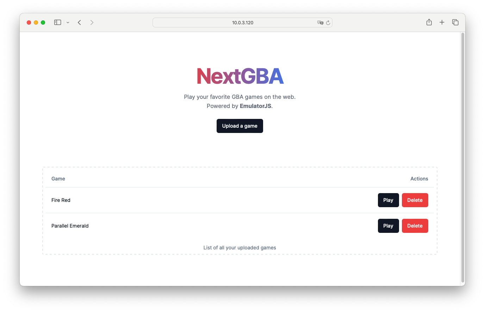
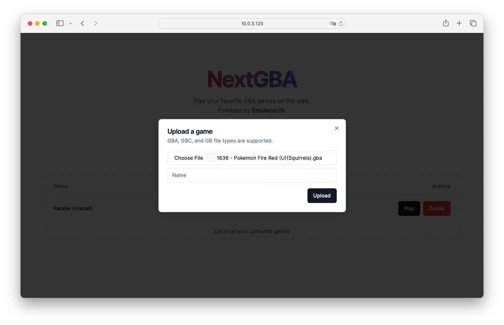
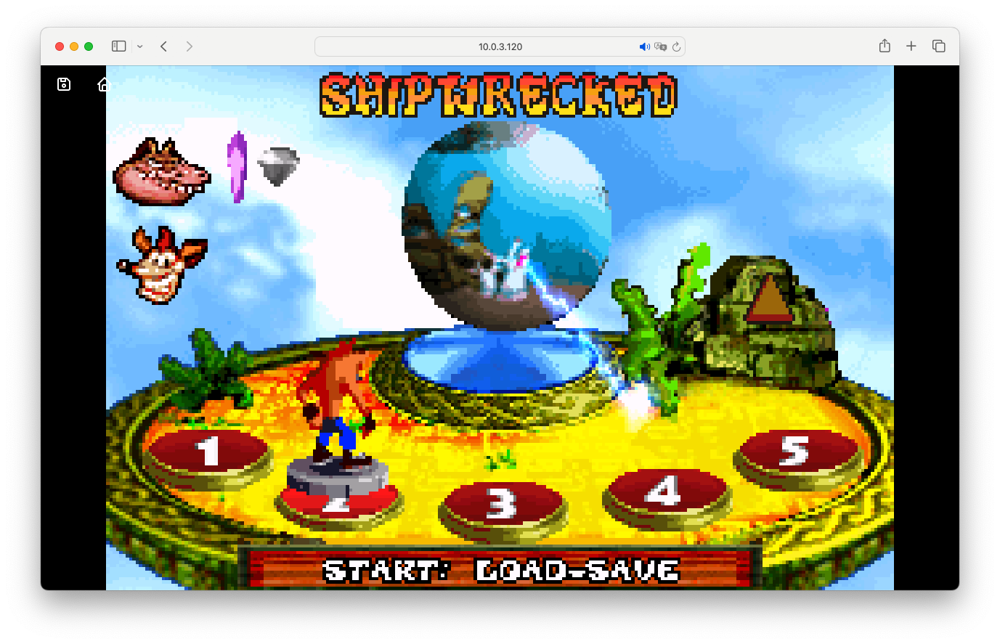

# NextGBA - All you gameboy games in a browser window

[](https://github.com/meienberger/nextgba/blob/master/LICENSE)
[](https://github.com/meienberger/nextgba/releases)


Have you ever wanted to play your favorite gameboy games in a self-hosted web app that can save the game state and can be accessed from anywhere on your network? **NextGBA** is your friend!
It emphasize a simple UI with all the features you could ever need. The game player is based on the very famous [EmulatorJS](https://emulatorjs.org/) project.





## ⚡ Getting Started

To get started simply create a docker-compose file with the following content:

```YAML
services:
  nextgba:
    container_name: nextgba
    image: ghcr.io/meienberger/nextgba:v0.0.4
    ports:
      - 3000:3000
    volumes:
      - ./data/games:/data/games
```

You can also spin it up through a tipi instance so everything will be preconfigured for you. Check out tipi [here](https://runtipi.io)

## ❤️ Contributing

Any kind of contributions are welcome on this project! If you encounter any issues or have any ideas for new features, feel free to open an issue or a pull request.

## 📜 License

NextGBA is licensed under the GNU General Public License v3.0. TL;DR — You may copy, distribute and modify the software as long as you track changes/dates in source files. Any modifications to or software including (via compiler) GPL-licensed code must also be made available under the GPL along with build & install instructions.
